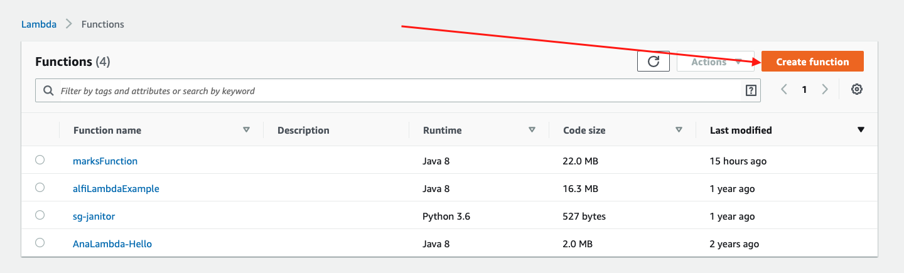
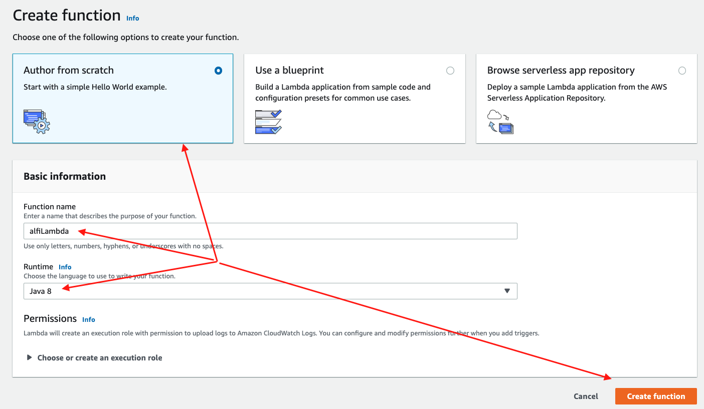
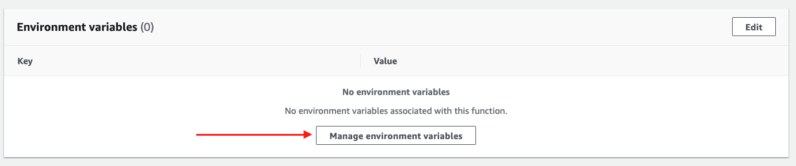
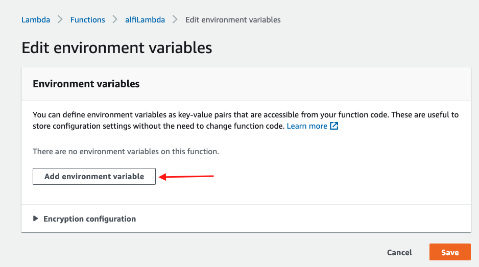
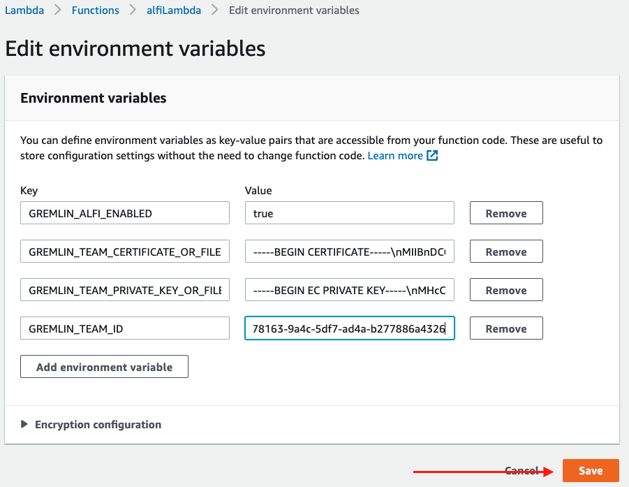

# alfi-lambda
Simple example showing how to use Gremlin's ALFI to attack a Lambda function

# Prerequisites
* A Gremlin account
* An AWS account
* Maven 2+
* Java 8+

# Steps to get up and running
## AWS Lambda setup
1. Log into the AWS console, navigate to the Lambda service and select the bright orange button that says "Create Function".

2. Leave the preselected "Author from Scratch" tile selected, give your function a name, give your function a name, and finally click the bright orange button that says "Create Function".

3. Once your function is created, scroll down to the "Environment Variables" section then click the white "Manage environment variables" button.

4. On the next screen, click the white "Add environment variable" button.

5. Add the following environment variables then click the bright orange "Save" button.

*NOTE:* The newlines `\n` in the certificate and private keys.

| Key        | Value           | 
| ------------- |:-------------:|
| GREMLIN_ALFI_ENABLED      | true |
| GREMLIN_ALFI_IDENTIFIER      | LAMBDADEMO      |
| GREMLIN_TEAM_CERTIFICATE_OR_FILE | -----BEGIN CERTIFICATE-----\n<certificate output>\n-----END CERTIFICATE-----|
| GREMLIN_TEAM_PRIVATE_KEY_OR_FILE | -----BEGIN CERTIFICATE-----\n<certificate output>\n-----END CERTIFICATE-----|
| GREMLIN_TEAM_ID | < Your Team ID > |
 

