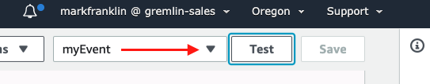

# alfi-lambda
Simple example showing how to use Gremlin's ALFI to attack a Lambda function

# Prerequisites
* A Gremlin account
* An AWS account
* Maven 2+
* Java 8+

# Steps to get up and running
## AWS Lambda setup
* Log into the AWS console, navigate to the Lambda service and select the bright orange button that says "Create Function".

* Leave the preselected "Author from Scratch" tile selected, give your function a name, give your function a name, and finally click the bright orange button that says "Create Function".

* Once your function is created, scroll down to the "Environment Variables" section then click the white "Manage environment variables" button.

* On the next screen, click the white "Add environment variable" button.

* Add the following environment variables then click the bright orange "Save" button.

*NOTE:* The newlines `\n` in the certificate and private keys.

| Key        | Value           | 
| ------------- |:-------------:|
| GREMLIN_ALFI_ENABLED      | true |
| GREMLIN_ALFI_IDENTIFIER      | LAMBDADEMO      |
| GREMLIN_TEAM_CERTIFICATE_OR_FILE | -----BEGIN CERTIFICATE-----\n<certificate output>\n-----END CERTIFICATE-----|
| GREMLIN_TEAM_PRIVATE_KEY_OR_FILE | -----BEGIN CERTIFICATE-----\n<certificate output>\n-----END CERTIFICATE-----|
| GREMLIN_TEAM_ID | < Your Team ID > |

* Scroll up to the "Function code" section then replace the default "Handler" input text with `com.alfilambda.AlfiDemoHandler::handleRequest`.

* Clone this repository, change to its directory then execute `mvn clean package`

* From the same "Function code" section, click the "Upload" button. Upload `alfi-lambda/target/alfi-lambda-1.0-SNAPSHOT-jar-with-dependencies.jar`. Then click the orange "Save" button at the top right of your screen.

* Once the upload completes, ignore the blue notification about the lambda being too large to enable inline code editing. Click the Test button to run the function.

* Give your event a name then scroll to the orange "Create" button at the bottom right of the screen

* Click the "Test" button again. The first time you run your lambda, you will have to wait a few seconds due to the cold start problem

* When the function completes, expand the details and note the return body of `"200 OK"` and the log message of `Lambda took 7136 millis`. Of course the lambda execution time will vary.

**Congratulations! You're now ready to setup a Gremlin ALFI Experiment to attack this Lambda Function**